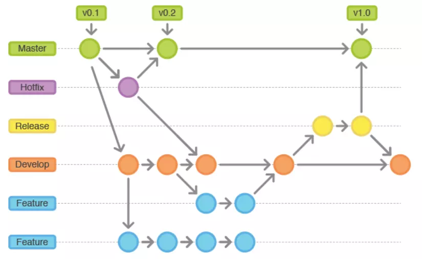

Git Flow

- Tài liệu tham khảo: https://cafedev.vn/tu-hoc-git-tim-hieu-co-ban-ve-git-flow/

- Là nguyên tắc để dev tuân theo khi dùng git
- Đc gọi là mô hình phân nhánh



- Được chia thành các nhanh sau
- [ ] main
- [ ] develop
- [ ] hotfixes
- [ ] release
- [ ] feature
- [ ] bugfix

